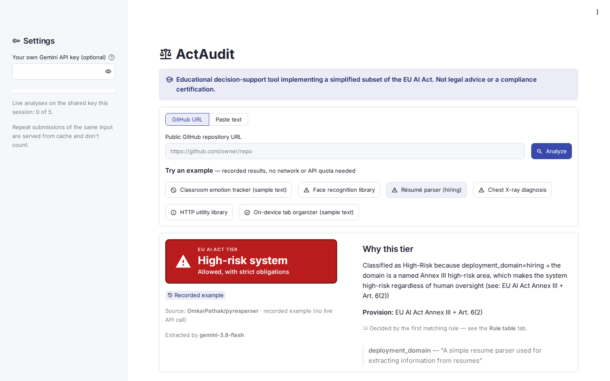
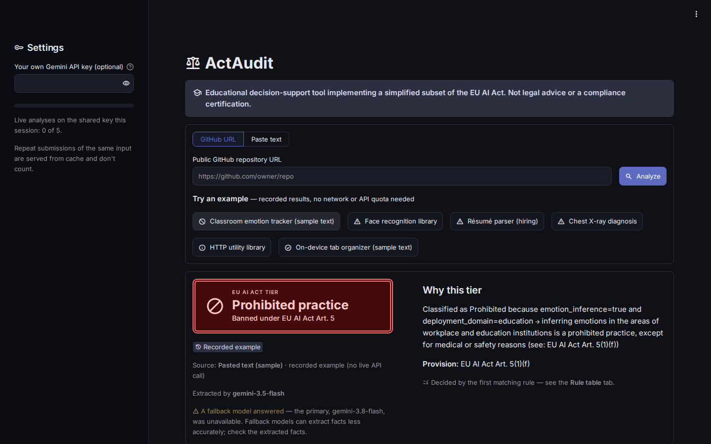
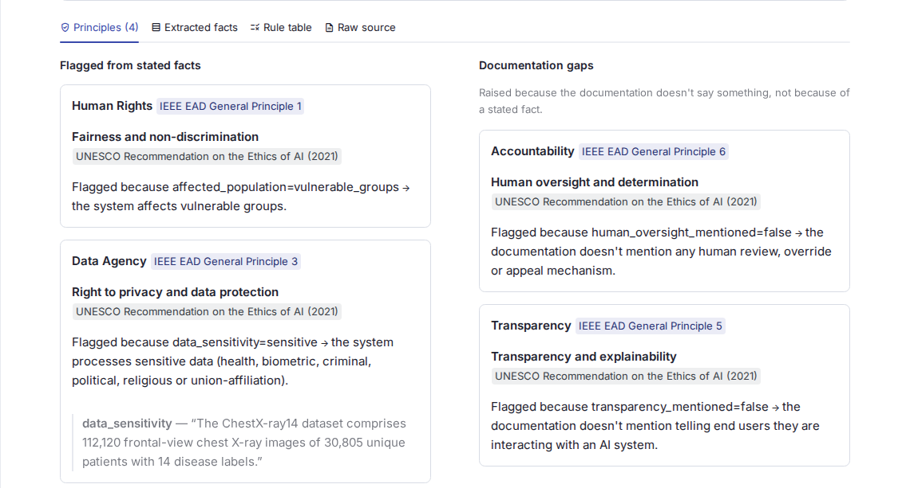
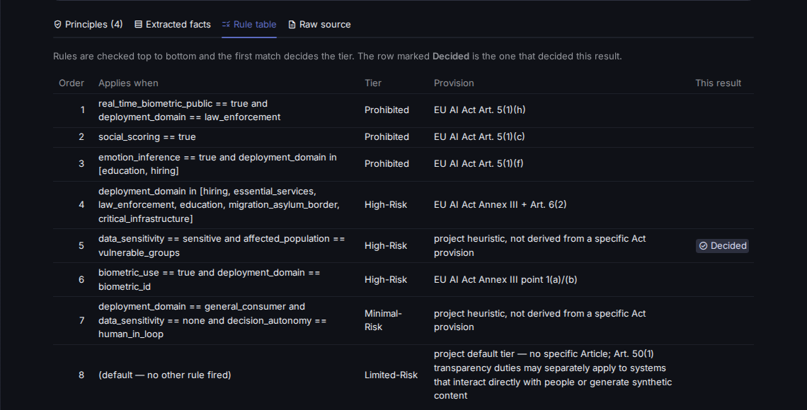

# ActAudit

**Automated risk classification of AI systems against the EU AI Act, with UNESCO and IEEE ethics flags.**

Paste a public GitHub repository URL or any piece of documentation (a README, a model card, a product description). ActAudit reads it, extracts the facts that matter for regulation, and classifies the system into an EU AI Act risk tier, showing exactly which rule decided the tier and why.

> **Educational decision-support tool implementing a simplified subset of the EU AI Act. Not legal advice or a compliance certification.**

**Live demo:** https://act-audit.streamlit.app/

## How it works: the LLM reads, the rules decide

Asking an LLM "is this system high-risk?" gives an answer that can't be audited and may change from one run to the next. ActAudit splits the job in two:

1. **Extract facts (LLM).** Gemini reads the text and fills a fixed schema of observable facts, such as the deployment domain, whether biometric data is used, how autonomous the decisions are and who is affected. It quotes the text as evidence for each fact. It never assesses risk or legality.
2. **Apply the rule table (deterministic).** An ordered list of plain Python rules maps those facts to a tier. The first rule that matches wins. There's no machine learning and no scoring, so the same facts always give the same tier.
3. **Explain the tier.** The result shows the justification, the legal provision, the rule table with the deciding rule marked, the extracted facts with their evidence, and UNESCO/IEEE principle flags.

This split means the unreliable part (reading messy text) is limited to producing a small structured object that you can inspect, while the decision itself is fully reproducible and cites its source.

## Screenshots

| High-Risk result | Prohibited result (dark theme) |
|---|---|
|  |  |
| **Principles tab** | **Rule table tab** |
|  |  |

More screenshots, plus the full methodology, results and ethical framing, are in the course report: [`docs/REPORT.md`](docs/REPORT.md).

## Run it locally

Requires Python 3.12.

```bash
git clone https://github.com/AnkonM/actaudit.git
cd actaudit
python3 -m venv .venv
source .venv/bin/activate
pip install -r requirements-dev.txt
cp .env.example .env        # then paste your Gemini API key into .env
streamlit run app.py
```

You can get a free Gemini API key from [Google AI Studio](https://aistudio.google.com/). The six example buttons in the app work **without** a key or network access, because they load recorded results.

Run the tests (offline, no key needed):

```bash
pytest
```

One live end-to-end test is skipped by default. Run it with `ACTAUDIT_LIVE=1 pytest`; it uses one Gemini request.

## Deploy

The app is ready for [Streamlit Community Cloud](https://streamlit.io/cloud):

- Point a new app at this repository with `app.py` as the entry point and **Python 3.12**.
- Add this to the app's **Secrets** settings (never commit a real key):
  ```toml
  GEMINI_API_KEY = "your-key-here"
  ```

The app reads the key from `st.secrets` first and falls back to the `GEMINI_API_KEY` environment variable, which is what a local `.env` sets. With no key at all, the examples still work and live analysis shows a clear "not set up" message.

**Quota protection for a public deployment:**
- Identical inputs are cached for 24 hours, so repeats never spend quota twice.
- Each browser session is capped at 5 live analyses on the shared key.
- Visitors can paste their own Gemini key in the sidebar. It's held in session memory only and never logged or stored.
- If a Gemini model is out of quota or overloaded, the app falls back through `gemini-3.8-flash` → `3.7` → `3.6` → `3.5`, and says when a fallback model answered.

## The rule table

Rules are checked in order and the first match decides the tier. Citations were audited against [Regulation (EU) 2024/1689](https://eur-lex.europa.eu/eli/reg/2024/1689/oj).

| # | Applies when | Tier | Provision |
|---|---|---|---|
| 1 | Real-time biometric identification in public spaces, for law enforcement | Prohibited | Art. 5(1)(h) |
| 2 | Social scoring | Prohibited | Art. 5(1)(c) |
| 3 | Emotion inference in education or hiring | Prohibited | Art. 5(1)(f) |
| 4 | A named Annex III domain: hiring, essential services, law enforcement, education, migration/asylum/border, critical infrastructure | High-Risk | Annex III + Art. 6(2) |
| 5 | Sensitive data about vulnerable groups | High-Risk | Project heuristic (not an Act provision) |
| 6 | Biometric identification or categorisation | High-Risk | Annex III point 1(a)/(b) |
| 7 | General consumer use, no personal data, a human approves each decision | Minimal-Risk | Project heuristic (not an Act provision) |
| 8 | None of the above | Limited-Risk | Project default; Art. 50(1) transparency duties may apply |

Rule 4 applies regardless of human oversight: under Art. 6(2), membership of an Annex III domain makes a system high-risk. The exact conditions, as evaluated, are shown in the app's **Rule table** tab and defined in [`rules.py`](rules.py).

**Principle flags.** Separately from the tier, facts are mapped to UNESCO *Recommendation on the Ethics of AI* (2021) principles and to IEEE *Ethically Aligned Design* General Principles: Human Rights (1), Well-being (2), Data Agency (3), Transparency (5) and Accountability (6). Flags raised only because the documentation *doesn't say* something (for example, no mention of human oversight) are shown separately as documentation gaps.

## Limitations

- **Simplified law.** Rule 1 doesn't model the Art. 5(1)(h) statutory exceptions. Rule 4 doesn't model the Art. 6(3) narrow-task exemption, so it's over-inclusive. Rules 5, 7 and 8 are project heuristics, labelled as such, not Act provisions.
- **Healthcare.** Clinical and diagnostic AI becomes high-risk mainly through the medical-device route (Art. 6(1), Annex I), which a README can't establish, so ActAudit doesn't assess it. Only healthcare-*access* AI (triage, insurance pricing, benefit eligibility) is classified under Annex III.
- **README only.** ActAudit reads documentation, not code or data. It handles English only, fetches READMEs from the `main` or `master` branch of public repositories, and truncates text over about 8,000 characters for the model (the full text is still shown).
- **Extraction can be wrong.** An LLM extracts the facts, and older fallback models are less accurate. Every extracted fact and its evidence is shown so you can check it.
- **Thin documentation is a finding.** When a README says little, extraction confidence drops and the app says so. Documentation completeness is itself an accountability mechanism.
- **No legal validity.** ActAudit is a decision-support and educational tool, not a compliance certification.

## Project structure

```
app.py            Streamlit dashboard (UI only; talks to the backend through pipeline.py)
pipeline.py       fetch → extract → rules → principles
github_fetch.py   README fetch from GitHub, with specific errors
extractor.py      Gemini extraction: prompt, schema-constrained JSON, retry, model fallback
schema.py         the extraction schema (the LLM's output contract)
rules.py          the ordered rule table and evaluator
principles.py     UNESCO / IEEE principle flags
examples/         quick-pick examples (served from tests/fixtures/)
tests/            offline test suite, plus recorded fixtures
docs/             project blueprint, course report, screenshots
```

The full design rationale is in [`docs/ActAudit_Project_Blueprint.md`](docs/ActAudit_Project_Blueprint.md).

## Disclaimer

ActAudit is an educational decision-support tool that implements a simplified subset of the EU AI Act. It is not legal advice and not a compliance certification. For real compliance decisions, consult a qualified professional.
