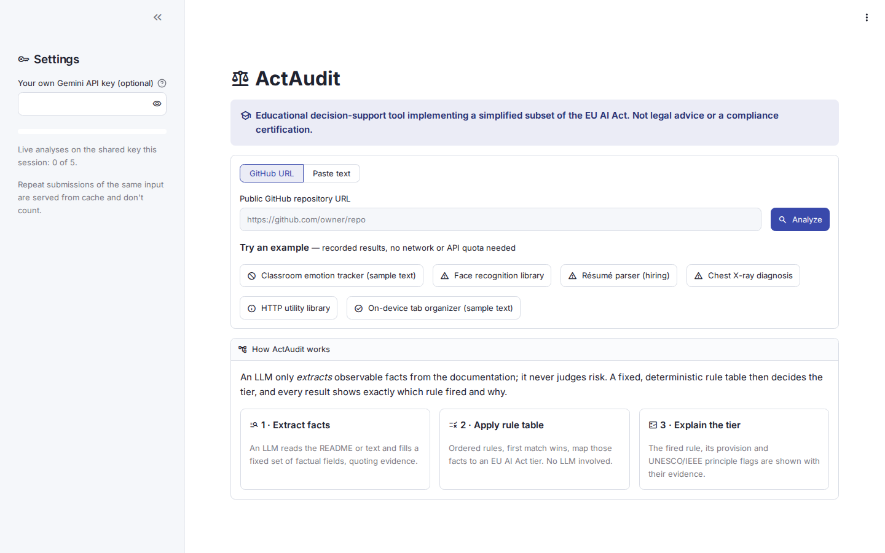
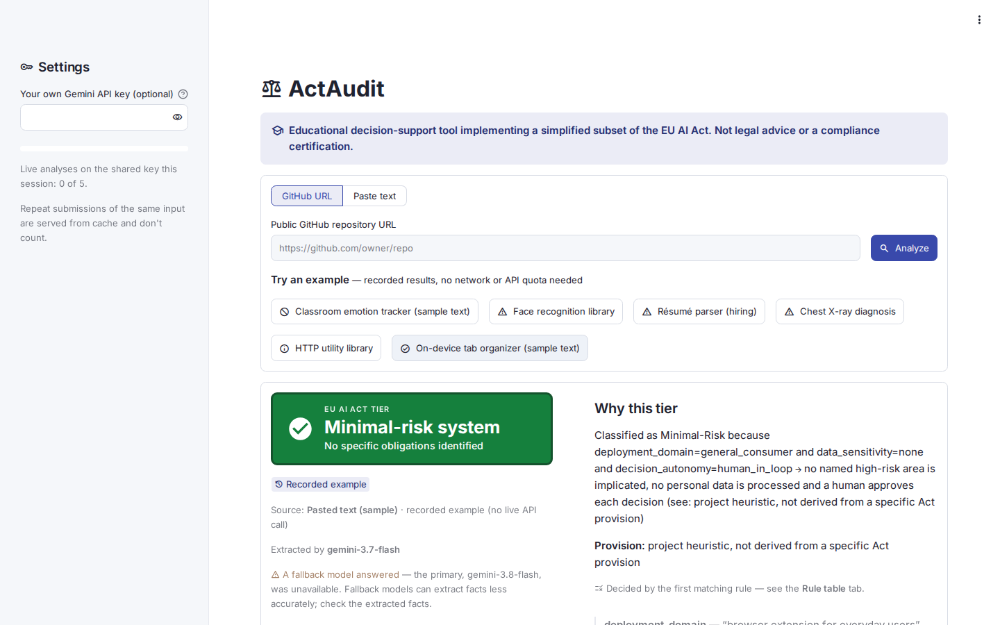

# ActAudit: Automated Risk Classification of AI Systems Against the EU AI Act, with UNESCO and IEEE Ethics Flags

**Course:** Ethics in AI & Data Science — Mini Project
**Author:** Ankon Mukherjee
**Live application:** https://act-audit.streamlit.app/
**Source code:** https://github.com/AnkonM/actaudit

> ActAudit is an educational decision-support tool implementing a simplified subset of the EU AI Act. It is not legal advice or a compliance certification.

---

## 1. Problem statement

Regulation (EU) 2024/1689, the EU AI Act, sorts AI systems into risk tiers: prohibited practices, high-risk systems with strict obligations, systems with transparency duties, and everything else. Working out which tier a given system falls into currently means a person with legal knowledge reading the system's documentation and mapping it by hand onto dense regulatory text. The same is true for ethics frameworks such as UNESCO's *Recommendation on the Ethics of Artificial Intelligence* (2021) and IEEE's *Ethically Aligned Design*.

That manual process is slow, inconsistent between reviewers, hard to reproduce, and out of reach for the small teams and start-ups that most need early guidance and are least likely to have compliance staff.

ActAudit automates the *reading* step and keeps the *judging* step deterministic. A user gives it a public GitHub repository URL or pastes any documentation (a README, a model card, a product description). A large language model extracts a fixed set of observable facts from that text, and a hand-written, ordered rule table maps those facts to an EU AI Act risk tier. The result shows the tier, the rule and legal provision that decided it, the evidence quoted from the source, and a separate set of UNESCO and IEEE principle flags.

## 2. Central design decision: the LLM reads, the rules decide

The obvious way to build this tool would be to ask an LLM "what risk tier is this system?". ActAudit deliberately does not do that.

- **An LLM's verdict can't be audited.** It gives no traceable reason, it can change between runs on the same input, and it can state a confident but wrong legal conclusion.
- **A rule engine can't read.** Given raw, unstructured documentation, it has nothing to work with.
- **Splitting the two solves both problems.** The LLM's job is limited to turning messy text into a small structured object: thirteen facts, each constrained to an enumerated set of values, with quoted evidence. The part that matters for a compliance decision, the tier, is then decided by plain code that anyone can read, test and step through by hand.

This split is enforced in the code, not just described:

- The extraction schema (`schema.py`) contains **no risk, tier or legality field**. The model is told "You are extracting observable facts only. Do not assess risk, legality, or compliance," and its output is parsed against that schema. Any value outside the allowed set is rejected before it reaches the rules.
- The rule engine (`rules.py`) has no machine learning, no scoring and no model calls. It is an ordered Python list, and the first rule that matches wins. The same facts always produce the same tier.
- The user interface (`app.py`) can only reach the backend through `pipeline.py`, and a test fails if the rule table shown in the app drifts from the table specified in the project blueprint.

Ethically, this avoids the irony of an opaque AI system deciding whether *other* AI systems are compliant. ActAudit practises the explainability it checks for: every tier comes with its reasoning trace, and every fact the LLM extracted is shown with its evidence, so a user can find and discount an extraction error instead of trusting a black box.

## 3. Methodology

### 3.1 Pipeline

```
Input (GitHub URL or pasted text)
  → Fetch and clean   README.md / README / readme.md, on main then master
  → Extract facts      Gemini, JSON-schema-constrained output, validated at the boundary
  → Apply rule table   ordered, first match wins, no LLM involved
  → Flag principles    UNESCO / IEEE, every applicable principle
  → Dashboard          tier, justification, provision, evidence, rule table, raw source
```

### 3.2 Input handling

- **GitHub repositories:** the README is fetched from `raw.githubusercontent.com`, trying three common file names on the `main` and then the `master` branch. There is no authentication, so only public repositories work. Each failure has its own message: invalid URL, repository not found, no README, GitHub rate limit, network error.
- **Pasted text:** used as-is, with excess whitespace removed.
- **Input length:** the copy sent to the model is capped at 8,000 characters and marked "(truncated)". The full original is always kept and shown in the app's Raw source tab, so a user can see what the model did not.

### 3.3 Fact extraction (LLM)

The model fills this schema:

| Field | Values |
|---|---|
| `system_purpose` | free text, ≤ 200 characters |
| `deployment_domain` | hiring, essential_services, law_enforcement, biometric_id, education, content_moderation, critical_infrastructure, migration_asylum_border, general_consumer, other |
| `data_sensitivity` | none, personal, sensitive |
| `decision_autonomy` | human_in_loop, human_on_loop, fully_autonomous |
| `affected_population` | general_public, vulnerable_groups |
| `biometric_use`, `emotion_inference`, `social_scoring`, `real_time_biometric_public`, `human_oversight_mentioned`, `transparency_mentioned` | true / false |
| `extraction_confidence` | high, medium, low |
| `evidence_snippets` | a short quotation from the source for each fact that was set |

The main choices in the extraction step:

- **Constrained output.** The request passes the schema to Gemini as a response JSON schema at temperature 0, instead of relying on prompt instructions alone. A malformed response is retried once. A second failure is reported to the user rather than guessed at.
- **Absent signals default towards lower risk, with low confidence.** If the text doesn't mention something, the field takes a fixed default (for example `deployment_domain: other`, every boolean false) and the model lowers its confidence. The app then warns that the result rests on incomplete documentation.
- **One exception to that default, found in testing.** Early live tests showed every README coming back as `human_in_loop` (a human approves each decision) even when nothing in the text said so. Because `human_in_loop` is one of the conditions for the Minimal-Risk rule, silence in the documentation was earning the lowest tier. The default was changed to `human_on_loop`, and `human_in_loop` must now be backed by quoted evidence.
- **Routing instructions for known confusions.** Clinical and diagnostic tools go to `other`, and healthcare-*access* tools (triage, insurance pricing, benefit eligibility) go to `essential_services`. Face-recognition libraries go to `biometric_id` even when the word "biometric" isn't used. A library built for a specific domain (for example a credit-scoring package) takes that domain, not `other`. The second and third instructions were added after live testing misrouted `ageitgey/face_recognition` and `ayhandis/creditR`.
- **Model fallback.** Free-tier Gemini quotas are per model, so the extractor tries `gemini-3.8-flash`, then 3.7, 3.6 and 3.5, moving on only when a model is out of quota or overloaded. Every result records which model answered, and the app warns when a fallback model was used, because older models extract less reliably.

### 3.4 Rule table (deterministic)

Rules are checked from top to bottom, and the first match decides the tier. Citations were audited against the text of Regulation (EU) 2024/1689 on EUR-Lex.

| # | Applies when | Tier | Provision |
|---|---|---|---|
| 1 | `real_time_biometric_public` and `deployment_domain == law_enforcement` | Prohibited | Art. 5(1)(h) |
| 2 | `social_scoring` | Prohibited | Art. 5(1)(c) |
| 3 | `emotion_inference` and domain in {education, hiring} | Prohibited | Art. 5(1)(f) |
| 4 | domain in {hiring, essential_services, law_enforcement, education, migration_asylum_border, critical_infrastructure} | High-Risk | Annex III + Art. 6(2) |
| 5 | `data_sensitivity == sensitive` and `affected_population == vulnerable_groups` | High-Risk | Project heuristic, not an Act provision |
| 6 | `biometric_use` and `deployment_domain == biometric_id` | High-Risk | Annex III point 1(a)/(b) |
| 7 | domain `general_consumer`, `data_sensitivity == none`, `decision_autonomy == human_in_loop` | Minimal-Risk | Project heuristic, not an Act provision |
| 8 | none of the above | Limited-Risk | Project default; Art. 50(1) transparency duties may apply |

**How the citations were checked:**

- **Rule 1:** Art. 5(1)(h) only prohibits real-time remote biometric identification in publicly accessible spaces "for the purposes of law enforcement". The rule therefore requires the law-enforcement domain.
- **Rule 2:** the final text of Art. 5(1)(c) is not limited to public authorities, as some earlier drafts were. The rule therefore applies to any social scoring.
- **Rule 3:** Art. 5(1)(f) covers emotion inference "in the areas of workplace and education institutions". It does not require biometric data. Hiring is used as the closest workplace domain in the schema.
- **Rule 4 — corrected during the audit.** An earlier draft only made Annex III systems high-risk if a human did *not* approve each decision. Under Art. 6(2), Annex III domain membership makes a system high-risk regardless of human oversight, and the Art. 6(3) exemption doesn't depend on autonomy. This was a factual error, not a simplification, so the autonomy condition was removed rather than disclaimed.
- **Healthcare is not an Annex III domain.** Clinical and diagnostic AI is high-risk mainly through the medical-device route (Art. 6(1) and Annex I), which a README can't establish. Healthcare *access* (Annex III points 5(a), 5(c) and 5(d)) is covered under `essential_services`.
- **Rules 5, 7 and 8 are labelled in the app as project heuristics or defaults.** The Act has no general "Limited-Risk by default" provision. Art. 50 transparency duties apply only to particular kinds of system, such as systems that interact with people or generate synthetic content.

Each result states its tier as a justification sentence built from the fields that fired, for example:

> Classified as High-Risk because deployment_domain=hiring → the domain is a named Annex III high-risk area, which makes the system high-risk regardless of human oversight (see: EU AI Act Annex III + Art. 6(2)).

### 3.5 UNESCO and IEEE principle flags

Separately from the tier, extracted facts are mapped to principles from the two ethics frameworks. Unlike the rule table, this mapping isn't first-match: every applicable principle is flagged, and each flag lists every trigger that fired.

| Signal | UNESCO principle | IEEE EAD General Principle |
|---|---|---|
| no human oversight mentioned, or fully autonomous | Human oversight and determination | Accountability (6) |
| no transparency to users mentioned | Transparency and explainability | Transparency (5) |
| affects vulnerable groups | Fairness and non-discrimination | Human Rights (1) |
| sensitive data | Right to privacy and data protection | Data Agency (3) |
| social scoring, or real-time public biometric ID | Human dignity and autonomy | Well-being (2) |

The two "not mentioned" triggers fire because the documentation is *silent*, not because of anything it states. The app therefore shows those flags in a separate **Documentation gaps** group, apart from flags raised by stated facts. A flag raised by both kinds of trigger counts as fact-based.

The IEEE General Principle numbers were checked against *Ethically Aligned Design*, First Edition. The UNESCO principles are cited by document only; see §7.

### 3.6 Implementation and testing

- **Stack:** Python 3.12, Streamlit, the `google-genai` SDK and `requests`. The rule engine and schema use only the standard library.
- **Test suite:** 175 tests. 174 run offline with no API key, and one live end-to-end test is opt-in because it spends Gemini quota.

| Test file | Tests | What it covers |
|---|---|---|
| `test_rules.py` | 21 | One or more fact-sets per rule, precedence between rules, fall-through cases, justification text, and the rule table matching the blueprint |
| `test_schema.py` | 10 | Invalid enum values, non-boolean flags, over-long purpose text, unknown or missing keys |
| `test_extractor.py` | 29 | Mocked model responses: retry on malformed output, model fallback, key rejection, truncation, snippet filtering |
| `test_github_fetch.py` | 21 | URL parsing, README and branch fallback, each error type |
| `test_principles.py` | 32 | Every trigger, multi-trigger flags, the documentation-gap split |
| `test_pipeline.py` | 6 | End-to-end assembly offline, plus the opt-in live test |
| `test_app.py` | 56 | Streamlit AppTest: every tier, every error state, the usage cap, caching, WCAG AA contrast of the verdict colours |

- **Recorded fixtures:** real model responses for ten public repositories and two fictional descriptions are stored in `tests/fixtures/`. They keep extraction behaviour reproducible and power the app's six example buttons, which work with no network or key.

### 3.7 Dashboard

The app is a single page, deployed on Streamlit Community Cloud:

- **Input card:** a GitHub URL field or a text box, and six example buttons.
- **Verdict:** a colour-coded banner. Prohibited and High-Risk are both red, so they are also distinguished by icon, wording and border.
- **"Why this tier":** the justification and the provision, always on separate lines, followed by the quoted evidence.
- **Four tabs:**
  - Principles
  - Extracted facts, each with its evidence
  - Rule table, with the deciding rule marked
  - Raw source

Rule numbers are deliberately left off the verdict, because they mean nothing to a user. The verdict points to the Rule table tab instead.

For a public deployment on a free quota:

- Identical inputs are cached for 24 hours.
- Each browser session is limited to five live analyses on the shared key.
- Visitors can supply their own key. It is held in session memory only.

Screenshots are in Appendix A.

## 4. Results on real documentation

The table below lists all twelve recorded fixtures. "Expected domain" was labelled by the author before recording. It is a sanity check, not independent ground truth.

| Source | Expected domain | Extracted domain | Confidence | Tier (rule) | Model |
|---|---|---|---|---|---|
| OmkarPathak/pyresparser (résumé parser) | hiring | hiring | high | High-Risk (4) | 3.8-flash |
| ayhandis/creditR (credit scoring) | essential_services | essential_services | high | High-Risk (4) | 3.6-flash |
| DataSorcerer/Predicting-Insurance-Premium | essential_services | essential_services | high | High-Risk (4) | 3.6-flash |
| Vinaya-Sharma/TriageAI | essential_services | essential_services | medium | High-Risk (4) | 3.7-flash |
| ageitgey/face_recognition | biometric_id | biometric_id | high | High-Risk (6) | 3.6-flash |
| oarriaga/face_classification | biometric_id or other | biometric_id | high | High-Risk (6) | 3.7-flash |
| arnoweng/CheXNet (chest X-ray diagnosis) | other | other | high | High-Risk (5) | 3.8-flash |
| RasaHQ/rasa (chatbot framework) | general_consumer or other | other | **low** | Limited-Risk (8) | 3.6-flash |
| twitter/the-algorithm | content_moderation or general_consumer | general_consumer | high | Limited-Risk (8) | 3.6-flash |
| psf/requests (HTTP library) | other | other | high | Limited-Risk (8) | 3.6-flash |
| Classroom emotion tracker (fictional text) | education | education | high | Prohibited (3) | 3.5-flash |
| Tab organiser extension (fictional text) | general_consumer | general_consumer | high | Minimal-Risk (7) | 3.7-flash |

**All twelve were routed to their expected domain.** This is the final fixture set, recorded after the two prompt fixes described in §3.3. Before those fixes, two of the ten repositories were misrouted, both on fallback models. The Prohibited and Minimal-Risk examples are fictional descriptions, because no public repository could be found that cleanly represents either tier.

### Observations

- **CheXNet shows both the value and the limits of a heuristic.** As designed, the clinical tool was routed to `other`, because this tool doesn't assess the medical-device route. It is still classified High-Risk, but by Rule 5 (sensitive data about vulnerable groups), a project heuristic, and the app labels the provision that way. The outcome is probably right in substance, since a diagnostic device would very likely be high-risk under Annex I, but for a different legal reason than the Act would give. The honest labelling is what stops a user from mistaking it for an Annex III classification.
- **twitter/the-algorithm is Limited-Risk,** because content moderation and recommendation are not Annex III categories. This matches the Act's structure, although such systems face other EU obligations, for example under the Digital Services Act, which ActAudit doesn't cover.
- **Rasa is the only low-confidence result.** A general framework README says little about deployment, so the model defaulted most fields and flagged its own uncertainty. The app shows a warning rather than presenting the Limited-Risk tier as a confident finding.

## 5. Ethical framing

**The LLM extracts; it does not judge.** The tier that affects a person's compliance decision is produced by readable, deterministic, tested code with a cited provision. The LLM's influence is limited to a structured set of facts, which is displayed in full with evidence so it can be checked.

**Transparency by design.** Every result exposes the whole chain of reasoning: the source text, what was extracted from it, which rule fired, and why. The tool is built to satisfy the explainability principle it flags in others. Where a rule is a project heuristic rather than law, the interface says so instead of dressing it up as an Article.

**Documentation opacity is a finding, not just a limitation.** ActAudit can only classify what documentation discloses. In the twelve samples:

- **Human oversight:** only 2 of 12 mention any human review, override or appeal mechanism.
- **AI disclosure:** none of the 12 mention telling end users they are interacting with an AI system.

A system's apparent tier can therefore depend on how much its authors chose to write down. Vague documentation is a way, intended or not, for risk to stay hidden. ActAudit treats this as a result: it lowers extraction confidence, warns when a result rests on thin documentation, and lists documentation gaps as their own group of principle flags. The same reasoning drove the `decision_autonomy` default change in §3.3, so that silence in the documentation can never earn the lowest tier.

**Who the tool serves.** The intended users are small teams wanting an early, explainable first read on where their system might sit, and students learning how the Act is structured. It is not a replacement for legal review. The "not legal advice" notice stays on screen at all times rather than being hidden in a footer.

## 6. Limitations

- **Simplified law.**
  - Rule 1 doesn't model the Art. 5(1)(h) exceptions (targeted victim search, imminent threats to life, serious-crime suspects, subject to authorisation).
  - Rule 4 doesn't model the Art. 6(3) exemption for narrow procedural or preparatory tasks, so it over-includes.
  - Only the Annex III domains the schema can express are covered. For example, administration of justice is not included.
  - Rules 5, 7 and 8 are project heuristics or defaults, and are labelled as such.
- **Healthcare.** Clinical and diagnostic AI is not assessed through its real route (Art. 6(1), Annex I, medical-device regulation), because a README can't establish medical-device status.
- **Roles and obligations.** ActAudit assigns a tier only. It doesn't distinguish providers from deployers, check general-purpose AI model obligations (Chapter V), or list the obligations that follow from a tier.
- **Input scope.**
  - READMEs and pasted text only, not code, data or model weights.
  - English only.
  - Public repositories whose README is on `main` or `master`.
  - The model sees at most 8,000 characters.
- **Extraction can be wrong.** The facts come from an LLM, fallback models are less accurate, and the evaluation set is small and labelled by the author. Every fact is shown with its evidence so errors can be spotted.
- **No legal validity.** ActAudit is a decision-support and teaching tool, not a compliance certification.

## 7. Citation status

| Source | Status |
|---|---|
| Regulation (EU) 2024/1689 (EU AI Act): Art. 5(1)(c), (f), (h); Art. 6(1)–(3); Art. 50(1); Annex III points 1 and 5 | Audited against the EUR-Lex text |
| IEEE, *Ethically Aligned Design*, First Edition (2019), General Principles 1, 2, 3, 5, 6 | Verified against the IEEE General Principles document |
| UNESCO, *Recommendation on the Ethics of Artificial Intelligence* (2021) | Cited by document only. **Paragraph numbers not yet verified**, because the primary text could not be retrieved automatically. Also to check: whether "human dignity and autonomy" is one of the Recommendation's *values* (§III.1) rather than one of its *principles* (§III.2). |

## 8. Conclusion and future work

ActAudit shows that an LLM can be useful in a compliance setting without being trusted to judge. When its job is limited to extracting validated, evidence-backed facts, and the decision is left to transparent, cited rules, the result is reproducible and can be audited step by step. The project's main finding is ethical as much as technical: automated assessment is only as good as the documentation it reads, so documentation completeness is itself an accountability mechanism.

**Possible extensions:**
- A "sensitivity" view showing how the tier would change if a single fact were different, which makes the dependence on documentation visible.
- Batch comparison of repositories.
- Modelling the Art. 6(3) exemption.
- Reading code and model cards beyond the README.

## References

- Regulation (EU) 2024/1689 of the European Parliament and of the Council of 13 June 2024 laying down harmonised rules on artificial intelligence (Artificial Intelligence Act). *Official Journal of the European Union*. https://eur-lex.europa.eu/eli/reg/2024/1689/oj
- UNESCO (2021). *Recommendation on the Ethics of Artificial Intelligence*. https://unesdoc.unesco.org/ark:/48223/pf0000381137
- IEEE Global Initiative on Ethics of Autonomous and Intelligent Systems (2019). *Ethically Aligned Design: A Vision for Prioritizing Human Well-being with Autonomous and Intelligent Systems*, First Edition. IEEE.

## Appendix A — Screenshots

All screenshots use the app's recorded examples.

**Idle page:** input card, examples and the "How ActAudit works" explainer.


**High-Risk result** (résumé parser, Rule 4 — Annex III employment).


**Prohibited result, dark theme** (classroom emotion tracker, Art. 5(1)(f)). This example was answered by a fallback model, and the app says so.


**Minimal-Risk result** (on-device tab organiser, Rule 7).


**Principles tab:** flags from stated facts and documentation gaps, each with its IEEE identifier.


**Rule table tab** (dark theme): the full ordered table with the deciding rule marked.

